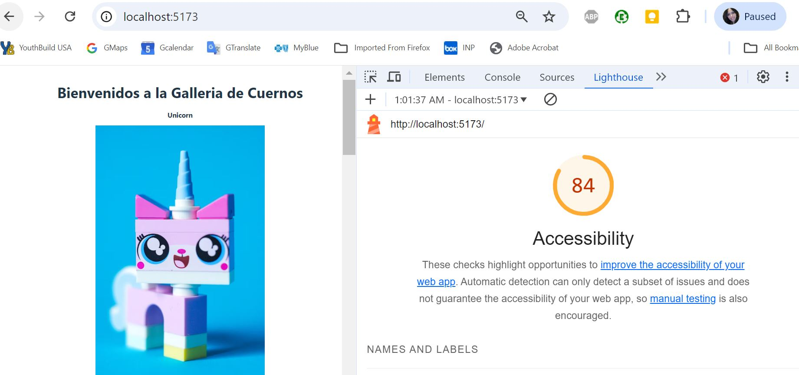

# Gallery of Horns

Al final de este módulo, crearás una aplicación que muestre imágenes e información de animales con cuernos. Esta aplicación te permitirá filtrar las imágenes por número de cuernos y elegir tu imagen favorita.

## Informe de Accesibilidad

Proporciona una captura de pantalla de tu puntuación después de ejecutar un informe de Accesibilidad de Lighthouse.

## Comencemos

### Requisitos

Para el desarrollo, solo necesitarás tener [Node](http://nodejs.org/) instalado en tu entorno.
Por favor, utiliza el plugin [Editorconfig](http://editorconfig.org/) adecuado para tu editor (no es obligatorio).

### Instala

    git clone https://github.com/ORG/PROJECT.git
    cd PROJECT
    npm install
### Configura la Aplicación

Todos los pasos de la configuración del entorno.

### Comienza y observa

    npm run dev
    npm start

### Build simple para producción

    npm run build

### Lenguajes y Herramientas

JS, JSX, JSON, HTML, CSS, MD

## Historial de cambios

N/A

## Colaboradores

Jessica Palacios Yamakawa
